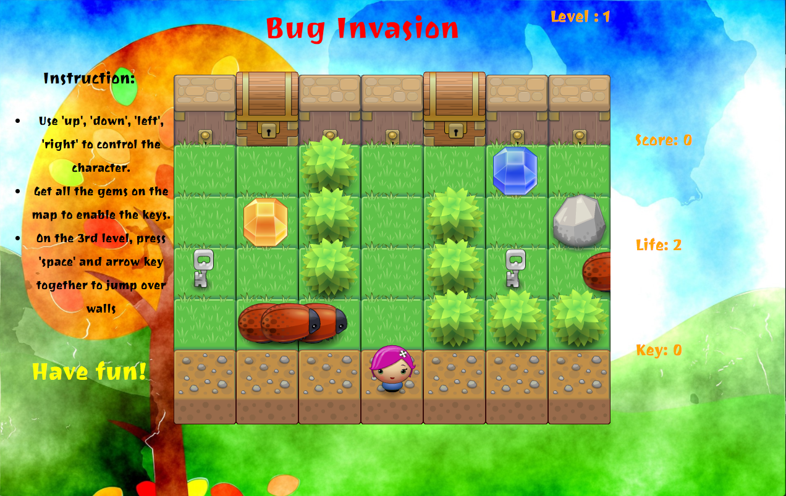
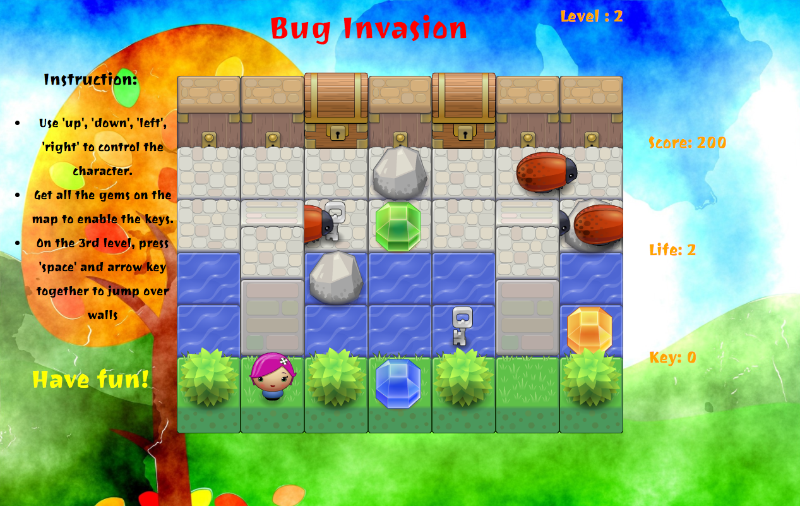

# Bug Invasion

it's a webpage game written mainly in javascript. The goal is to get as many gems as possible without touching any bugs and get the key to enter the next level.

### Screenshots

### How to play

 * Use 'up', 'down', 'left', 'right' to control the character.
 * Get all the gems on the map to enable the keys.
 * On the 3rd level, press 'space' and arrow key together to jump over walls.
### Ready to have fun

[Bug Invasion](https://jj1201.github.io/Bug-Invasion/)

### Links

The art assets are from [here](http://www.lostgarden.com/search/label/free%20game%20graphics).
The sound effects are from [Freesound](https://www.freesound.org/home/).
